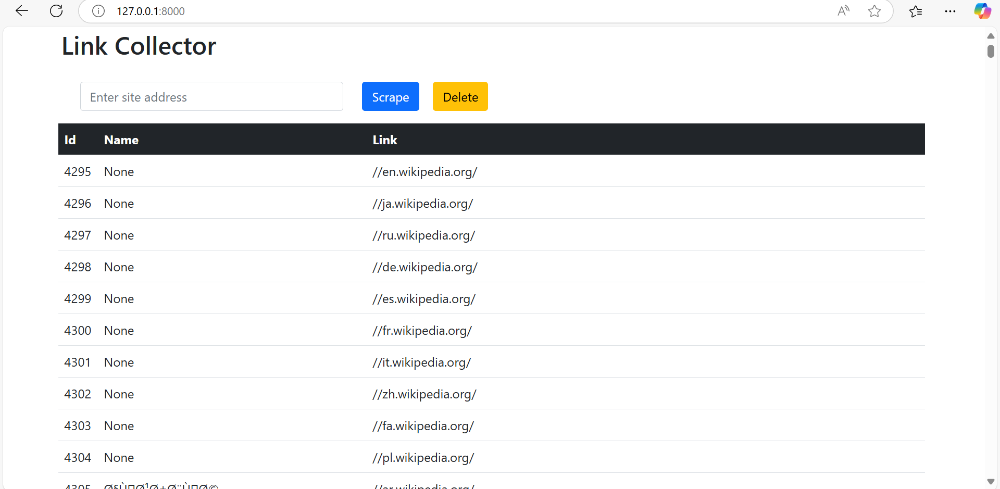

# Web Scraping Data Collect

## Overview
The Link Collector is a web-based application built with Django that allows users to scrape, view, and manage links from a given website. The application consists of two main components:

1. A user-friendly frontend interface for entering website addresses, scraping links, and viewing the collected data.
2. A Django admin panel for managing the scraped links.

## Features

- Scrape links from a given website.
- Display scraped links in a table format with ID, Name, and URL.
- Delete all links with a single click.
- Manage links using the Django admin interface.

## Screenshots
### Link Collector page


### Admin Interface


## Requirements

- Python 3.8+
- Django 4.x
- SQLite (default database for Django projects)
- Bootstrap 5 (for frontend styling)

## Installation

1. **Clone the repository**:
   ```bash
   git clone https://github.com/CoderMahruf/Web-Scraping.git
   cd mysite/
   ```

2. **Set up a virtual environment**:
   ```bash
   python -m venv env
   source env/Scripts/activate 
   ```

3. **Install dependencies**:
   ```bash
   pip install -r requirements.txt
   ```

4. **Run database migrations**:
   ```bash
   python manage.py migrate
   ```

5. **Create a superuser for the admin panel**:
   ```bash
   python manage.py createsuperuser
   ```

6. **Start the development server**:
   ```bash
   python manage.py runserver
   ```

7. **Access the application**:
   - Frontend: `http://127.0.0.1:8000`
   - Admin Panel: `http://127.0.0.1:8000/admin`

## Usage

1. **Scraping Links**:
   - Enter a website address in the input field on the frontend.
   - Click the "Scrape" button to collect links.
   - The scraped links will appear in a table with their IDs and URLs.

2. **Managing Links**:
   - Use the "Delete" button on the frontend to remove all links.
   - In the Django admin panel, manage links individually (edit, delete, or add new ones).

## Models

- **Link**:
  - `id` (AutoField): Unique identifier for each link.
  - `name` (CharField): Name of the link (optional, default is `None`).
  - `url` (URLField): URL of the link.

## Frontend Design

The frontend is styled using Bootstrap for a clean and responsive user interface. Key components include:

- **Input Field**: For entering the website address.
- **Buttons**:
  - "Scrape": To start scraping links.
  - "Delete": To clear all scraped links.
- **Table**: Displays the scraped links with columns for ID, Name, and URL.

## Admin Panel

The Django admin panel provides an interface for managing the scraped links:

- View and search links.
- Edit, delete, or add new links.
- Batch actions (e.g., delete multiple links).

## Future Enhancements

- Add support for filtering links by domain or keyword.
- Implement pagination for large datasets.
- Enhance the scraping mechanism to extract additional metadata (e.g., titles or descriptions).
- Add user authentication for frontend access.

## Contributing

Contributions are welcome! Please follow these steps:

1. Fork the repository.
2. Create a new branch for your feature or bug fix.
3. Commit your changes with clear messages.
4. Push to your fork and submit a pull request.

## License

This project is licensed under the MIT License. See the LICENSE file for details.

